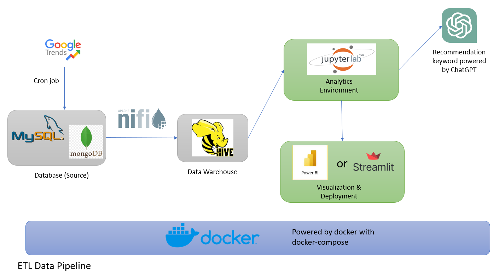
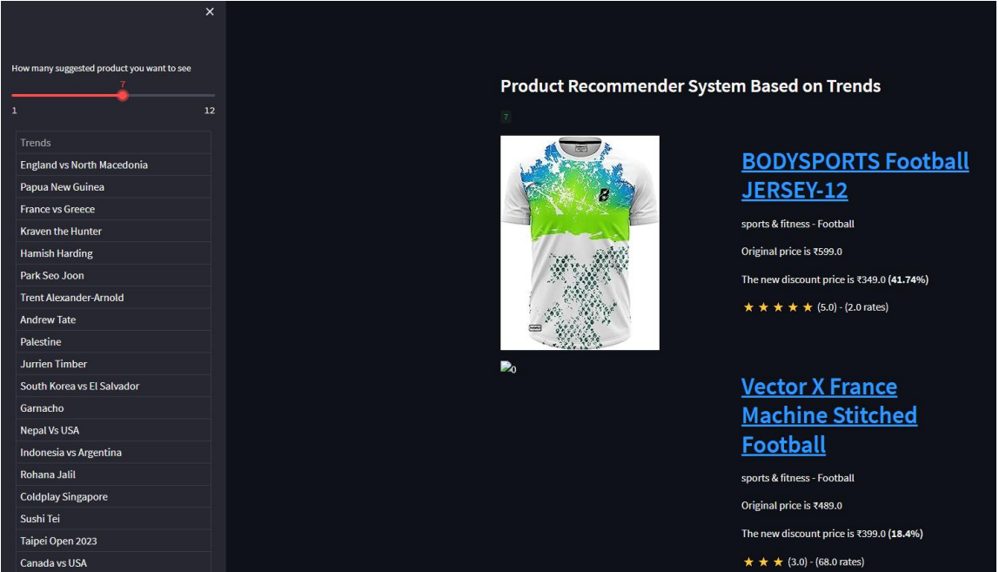
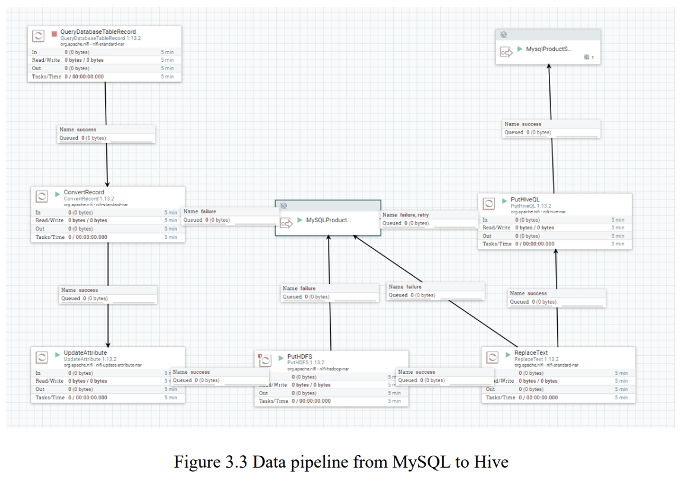

# Trending-Product-Recommendation-System

This is a group assignment project for WQD7007 Big Data Management for the Master of Data Science at University of Malaya (UM). This project simulates the ETL data pipeline which consists of 2 data sources and data warehouse. More details in [Project Architecture](#project-architecture).

The system will recommend the product to buy in Amazon based on the current trending search item in Google Trend.

---

#### Project Architecture
The project consists of 2 data sources, MySQL (Product Data) and MongoDB (Trending item for Google Trend) and data warehouses, Hive. Apache Nifi is used as integration platform to integrate data from data sources to data warehouse. JupyterLab used as development environment. 

It uses ChatGPT to recommend product based on trending item. The application is using Streamlit for visualization. For more details, please refer to the full report - "WQD7007 G3 Group Project.pdf".

#### Dataset Used
The dataset used in this project is [Amazon product dataset from Kaggle](https://www.kaggle.com/datasets/lokeshparab/amazon-products-dataset).

 

#### Demostration

